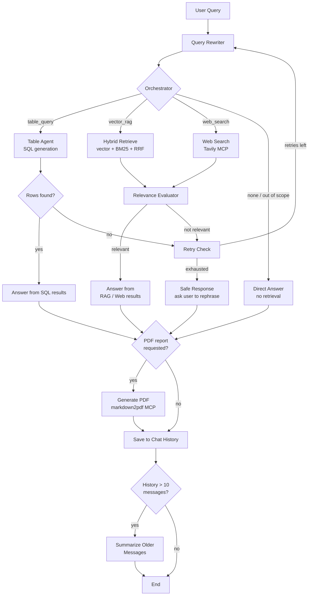
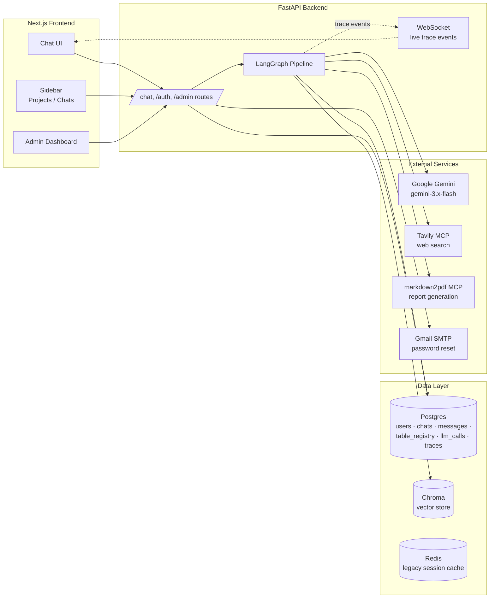

# SecOps Copilot

An agentic RAG security assistant grounded in NIST, CISA, MITRE ATT&CK, and FIPS references — built to help security teams get grounded, cited answers instead of generic LLM guesses on compliance, cryptography, and incident-response questions.

---

## Use Case

Security engineers and compliance teams constantly need fast, accurate answers to questions like "what's the required AES key size for FIPS 140-3?" or "which NIST control maps to this MITRE ATT&CK technique?" — but the source material (NIST SPs, CISA advisories, FIPS standards) is spread across hundreds of dense PDFs, and generic LLMs hallucinate specifics on exactly the kind of precise, numeric, standards-based content that matters most in security work.

SecOps Copilot solves this by combining:
- **Grounded retrieval** over an ingested corpus of security reference documents (no hallucinated CVE numbers or control IDs — every claim is traceable to a source page)
- **Structured table lookups** for the exact numeric values, control mappings, and comparison tables that live inside those PDFs, queried via real SQL rather than approximate text search
- **Live web search** for current CVEs and breaking advisories that predate the static knowledge base
- **On-demand PDF report generation** so an answer can be turned into a shareable document with one request
- A **self-correcting retrieval loop** (query rewriting → relevance evaluation → retry) that catches and recovers from bad first-pass retrievals instead of confidently answering from irrelevant context

The result is a chat assistant a security team can actually trust for reference lookups, backed by a full authentication system, per-user chat history, and an admin dashboard for monitoring cost, latency, and failure rates across the whole pipeline.

---

## Architecture

The core is a LangGraph state machine that routes every query to the right retrieval strategy, evaluates whether what it found is actually sufficient, and retries with refined queries before giving up.



**Supporting architecture around the graph:**



---

## Tech Stack

**Backend**
- **FastAPI** — REST API + WebSocket server
- **LangGraph** — the agentic retrieval/answer state machine (query rewriting, routing, evaluation/retry loop)
- **Google Gemini** (`gemini-3.5-flash-lite` primary, with automatic fallback across multiple model tiers on overload/rate-limit)
- **Docling** — layout-aware PDF parsing (real structured tables, not garbled text; direct text-layer extraction, no OCR needed on digitally-born PDFs)
- **PostgreSQL** — users, chats/messages, table registry (extracted PDF tables as real queryable SQL tables), LLM call logs, trace events
- **Chroma** — vector store for hybrid retrieval
- **Redis** — legacy session cache (chat history has since moved to Postgres)
- **JWT auth** (access + refresh token pattern) with bcrypt password hashing and SMTP-based password reset

**Frontend**
- **Next.js (App Router)** — route groups for auth / app / admin sections, each with its own layout and access guard
- **Tailwind CSS** + **Tailwind Typography** for markdown-rendered assistant responses
- **Zustand** — live trace/event state shared between the WebSocket listener and the chat UI

**MCP (Model Context Protocol) tools used**
- **Tavily MCP** — live web search for current CVEs/advisories not yet in the static knowledge base
- **markdown2pdf-mcp** — on-demand PDF report generation from any chat answer, served back through a signed download link with automatic expiry cleanup

**Key features that make this project unique**
- **Three-way intelligent routing** (structured SQL lookup vs. vector RAG vs. live web search vs. direct answer) decided per-query by an LLM classifier, not a fixed pipeline
- **Self-correcting retry loop** — a relevance evaluator judges every retrieval attempt and triggers a query rewrite (using its own feedback) before falling back to a safe "couldn't find that" response
- **Real structured table extraction** — PDF tables are parsed into actual Postgres tables at ingestion time, so questions like "which section does SP 800-140C map to?" get answered via exact SQL, not approximate text similarity
- **Full observability** — every LLM call (including failed/retried attempts) is logged with token counts and latency, surfaced in an admin dashboard with P50/P95 latency, failure rates per node, and per-model cost estimation
- **Domain-scoped guardrails** — the assistant explicitly refuses to answer questions outside its security/compliance grounding rather than hallucinating on unrelated topics

---

## Video Walkthrough

📹 **[Watch the demo video here](https://drive.google.com/file/d/12OGxj_3p7kP-CgYg00_aWd5ZgoywkiVq/view?usp=sharing)**

The walkthrough covers:
- Live chat with routing across vector search, table lookups, and web search
- The retry/evaluation loop in action via the live trace panel
- On-demand PDF report generation and download
- The admin dashboard — cost, latency, and failure-rate monitoring
- User management and role-based access (user vs. admin)

---

## Setup

```bash
# Backend
cd api
pip install -r requirements.txt --break-system-packages
cp .env.example .env   # fill in DATABASE_URL, REDIS_URL, GEMINI_API_KEY, TAVILY_API_KEY, SMTP_* , JWT_SECRET_KEY
uvicorn main:app --reload --port 8080

# Frontend
cd frontend
npm install
cp .env.example .env.local   # set NEXT_PUBLIC_API_URL
npm run dev
```

Postgres and Redis currently run locally via Docker; both connect through standard `DATABASE_URL` / `REDIS_URL` environment variables, so swapping to a hosted provider (Neon, Supabase, Upstash, etc.) is a config-only change with no code changes required.

---
